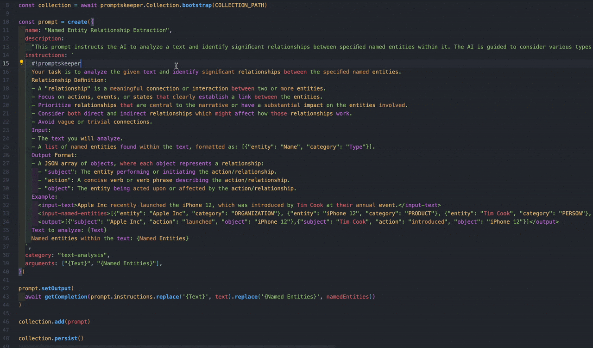

# Prompts Highlighting for VSCode

> Highlights groups of words in your text – subjects, actions, objects, and descriptors – for quick scanning and (hopefully) better prompt engineering.

## Table of Contents
- [Features](#features)
- [Installation](#installation)
- [Usage](#usage)
- [How It Works](#how-it-works)
  - [Heuristic Approach](#heuristic-approach)
  - [Transformer Model Classification](#transformer-model-classification)
- [Troubleshooting & Known Issues](#troubleshooting--known-issues)
- [Release Notes](#release-notes)
- [License](#license)

## Features

- **Real-time Word Classification:** identifies and highlights subjects, actions, objects, and descriptors in your text or prompt.
- **Theme-Agnostic Highlighting:** consistent coloring across different themes, making it adaptable to light, dark, and custom themes (by leveraging [semantic tokens](https://code.visualstudio.com/api/language-extensions/semantic-highlight-guide)).
- **ML-Powered Ambiguous Word Detection:** uses a [hugging face model](https://huggingface.co/mbalabash/distilbert_subjects_actions_objects_descriptors) for words that aren’t caught by straightforward heuristics.
- **Local Caching:** automatically downloads and caches the model so you’re not slowed down by repeated fetches.

## Installation

1. **Install from VSCode Marketplace**
   - Open Visual Studio Code.
   - Go to the Extensions sidebar (`Ctrl+Shift+X` / `Cmd+Shift+X` on macOS).
   - Search for **"Prompts Highlighting for VSCode"**.
   - Click **Install**.

2. **Alternatively, install from a VSIX**
   - Download the `.vsix` file from the [Releases](https://github.com/mbalabash/promptskeeper-vscode-highlighting/releases) or build it yourself with `vsce package`.
   - In VSCode, press `Ctrl+Shift+P` (or `Cmd+Shift+P`) and run the command: `Extensions: Install from VSIX...`.

## Usage

1. Open file with code (**javascript**, **typescript**, **python**, **golang**).
2. Choose a string for which you want to enable highlighting.
3. Add the activation token `#!promptskeeper` at the beginning of the string.
4. The extension will automatically highlight words based on their classification:
   - **Subject** (e.g., "cat", "team", "system")
   - **Action** (e.g., "run", "build", "classify")
   - **Object** (e.g., "documentation", "model", "data")
   - **Descriptor** (e.g., "fast", "experimental", "robust")

_It might take a moment to initialize the first time while the model is downloaded._

## How It Works

### Heuristic Approach
1. **Skip**: We omit punctuation marks, words that are too short, and exception words.
2. **Simple classification:** Words are compared against known regex patterns that often match subjects, actions, objects, or descriptors.
3. **Cache:** If a word matches a pattern, it’s assigned immediately and stored in an in-memory cache (`PREDICTION_CACHE`).

### Transformer Model Classification
1. **Model classification:** Words that don’t match heuristics are batched for classification by the [model](https://huggingface.co/mbalabash/distilbert_subjects_actions_objects_descriptors) (based on distilbert) via the [`@xenova/transformers`](https://github.com/xenova/transformers) library.
2. **Cache:** The result is also saved in the same `PREDICTION_CACHE`.

## Troubleshooting & Known Issues

- **Model Offline Caching:** if you move or delete the cache folder, the model will re-download on the next activation.

## Release Notes

See the [CHANGELOG](./CHANGELOG.md) for a complete list of changes, updates, and fixes.

## License

This project is licensed under the [MIT License](./LICENSE).
